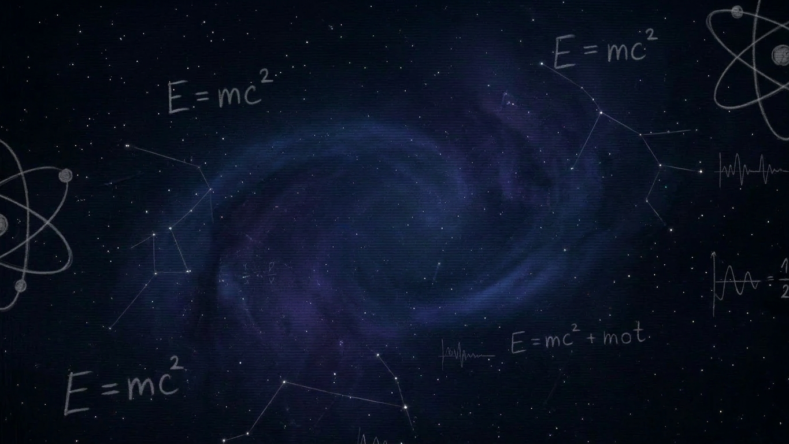



  

<table width="100%">
  <tr>
    <td width="65%" valign="top">

<h2>Hi there, I'm <b>Disha</b> 👋</h2>

<b>I'm an aspiring software developer</b> who loves building practical projects (especially backend + real-time).

<h3>What I'm up to</h3>

- 🚀 Building projects and sharpening problem-solving
- 📚 Currently learning: clean architecture, scaling basics, and better system design habits
- 🤝 Open to: internships, entry-level roles, and collaborations

<h3>Tech stack I use</h3>

  
  
  
  
  

<h3>Featured projects</h3>

- 🧠 <a href="https://github.com/Dishagupta224/PriceWise"><b>PriceWise</b></a>
- ⚡ <a href="https://github.com/Dishagupta224/StatusPulse"><b>StatusPulse</b></a>

<h3>GitHub snapshot</h3>

  
  

<h3>Connect with me</h3>

  
  

    </td>
    <td width="35%" valign="top" align="center">
       
      
        
      <i>“Curiosity is the real superpower.”</i>
    </td>
  </tr>
</table>

